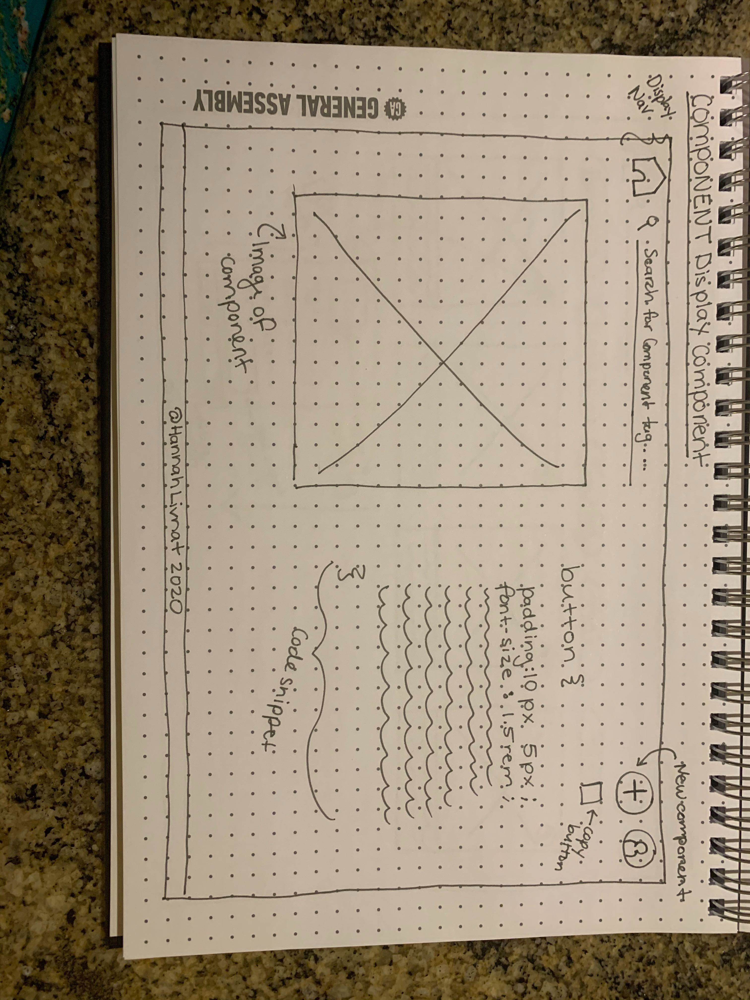

# PLANNING DOCUMENT

## PROJECT VISION

## The Gist

Component Library is a digital library of component images and corresponding code blocks.

Tech Stack: Postgresql, Ruby, React

Future Link: componentlibrary.netlify.app

### MVP 
* User is able to create a user profile
* User is able to sign in
* Upon sign in, user can view home page of all public components
* If user clicks on code component, they can view code block
* If user clicks on "copy" button, they copy button to their own profile
* If user clicks on "see more" button, they are taken to display page for component
* User can filter components by clicking tag buttons or by searching
* User can go to a personal profile containing all their private and public components
* User is able to filter through their private components using tags at top of page
* User can click the edit button on each component to edit or delete their component
* If user presses "+" button in nav, they can create a new component
* code blocks are formatted as actual code 
* There is a readme
* Hosted on netlify

### Stretch Goals
* Image uploading / figure out image hosting
* edit page for profile / user model 
* Use jQuery UI

## WIREFRAMES 

Log In Page

Home Page

Component Display Page

User Page

New Form Page

Components and Model Plan

## PROJECT TIMELINE

### Due Date
Wednesday July 22

### Benchmarks

* By July 10th EOD - Database set up through seed file in Postgresql and site is up on live link
* By July 14th EOD - Ruby backend is set up 
* By July 17th EOD - React Components are set up
* By July 19th EOD - features such as code block are added in and basic styling is done. Start getting into in-depth styling. 
* July 20th EOD - Styling is complete, Read me is written